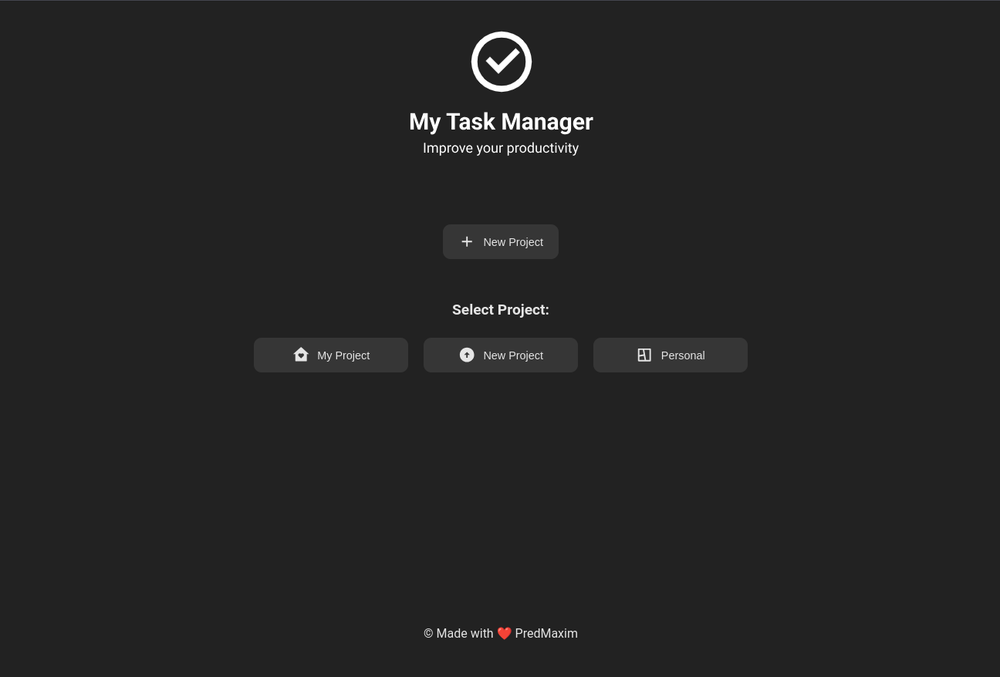
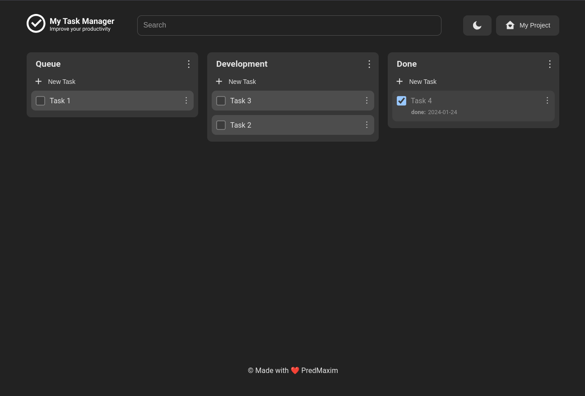
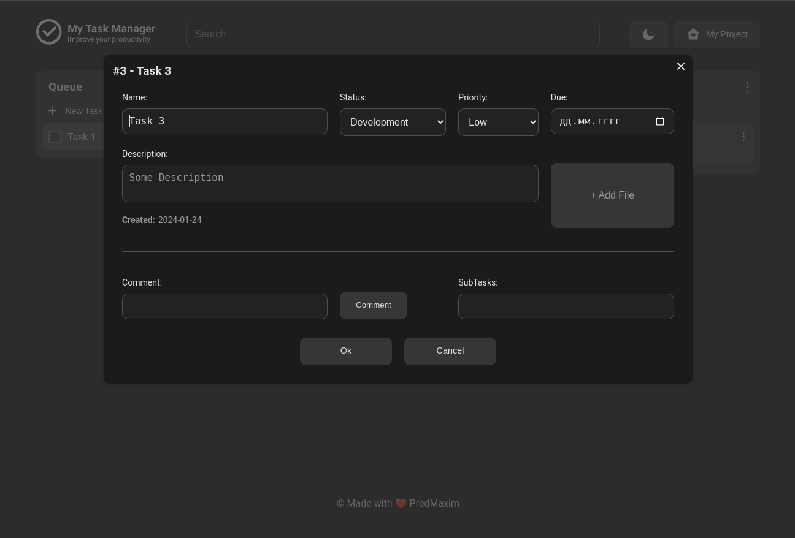

# My Task Manager

## Описание проекта

SPA TODO-приложение с использованием React и Redux.

- Проект содержит 2 страницы
  - Страница с выбором проекта
  - Страница с задачами

- Страница с задачами содержит в себе три колонки c возможностью изменения статуса с помощью drag-n-drop:
  - Queue
  - Development
  - Done

- Каждая задача имеет:
  - Номер задачи
  - Заголовок
  - Описание
  - Дата создания
  - Время в работе
  - Дата окончания
  - Приоритет
  - Текущий статус
  - Вложенные файлы (в разработке)
  - Возможность добавлять подзадачи (в разработке)
  - Система каскадных комментариев(т.е. Можно оставить комментарий под комментарием под комментарием...) (в разработке)

- Возможность редактирования задачи
-
- Возможность перетаскивания задач между столбцами `drag&drop`

- Даже если все подзадачи выполнены, это не значит, что и основная становится выполненной

- Поиск по номеру задачи и заголовку

- Адаптация под мобильные устройства

## Структура проект

В проекте находится сервер и клиент (папки `server` и папка `client` соответственно).
Сервер запускает базу данных через `docker-compose`, который находится по пути `/server/docker-compose.yml`

## Начало работы

Прежде чем начать установите `docker engine` или `docker desktop`, что бы запустить базу данных.
После этого перейдите в папку `/server` внутри проекта, запустите его командой в терминале:
`npm run start`.
Откройте новую вкладку терминала, перейдите в папку `/client` внутри проекта и запустите клиент командой:
`npm run start`.
Готово!
