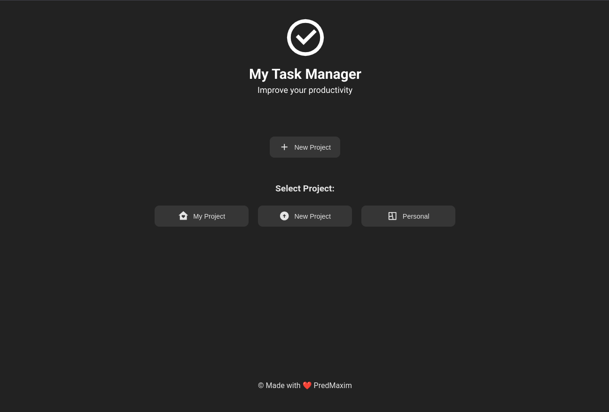
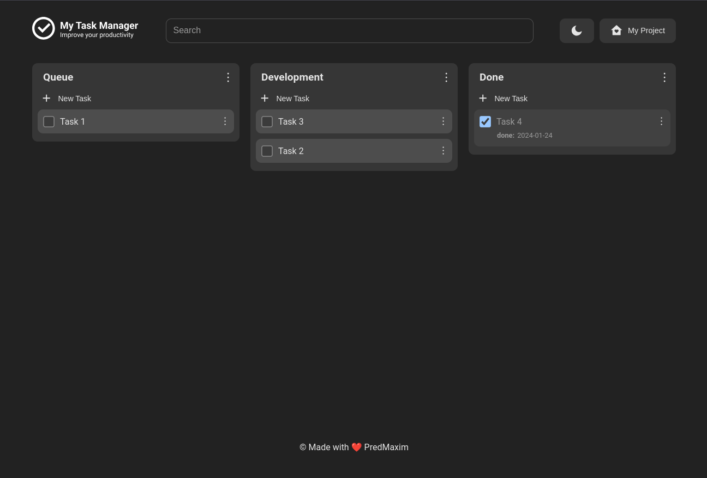
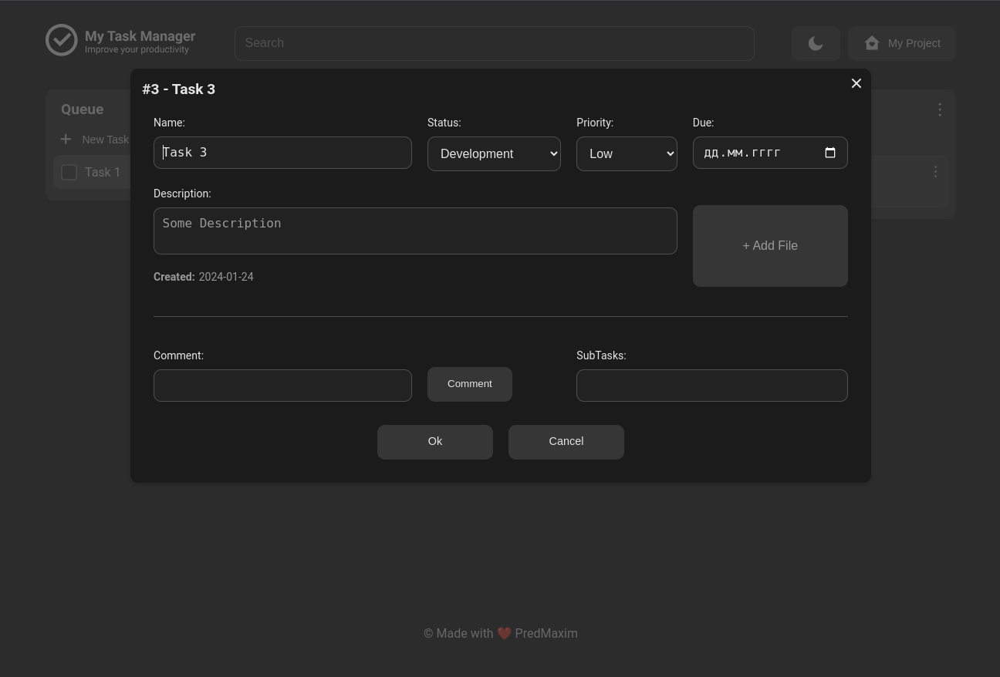

# My Task Manager

## Project Description

SPA TODO application built with React and Redux, supporting drag&drop for tasks and statuses.

### Main Features

- Project selection on a separate page
- Task page with unlimited number of statuses (columns)
- Drag&drop tasks between any statuses
- Drag&drop statuses themselves (change columns order)
- Search tasks by number and title (search works across all statuses)
- Edit tasks
- Mobile adaptation

### Task includes

- Task number
- Title
- Description
- Creation date
- Time in progress
- End date
- Priority
- Current status
- Attachments (in development)
- Subtasks (in development)
- Threaded comments (in development)

### Technical details

- Server and client in separate folders (`server`, `client`)
- Server uses a database via Docker (`/server/docker-compose.yml`)
- Drag&drop implemented with `@dnd-kit` library
- State managed with Redux

## Project Startup

1. Install Docker Engine or Docker Desktop to run the database.
2. In the project root, run: `yarn start`
3. Open the application in your browser.
